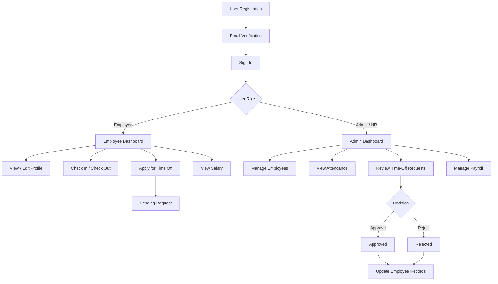
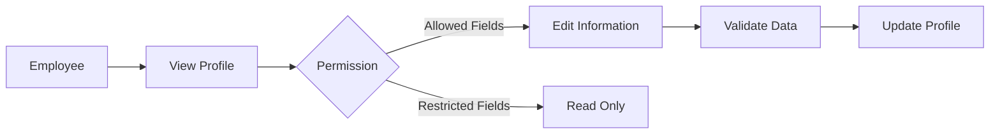
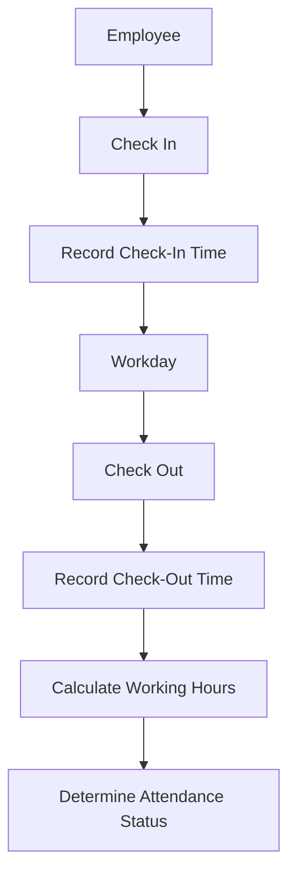
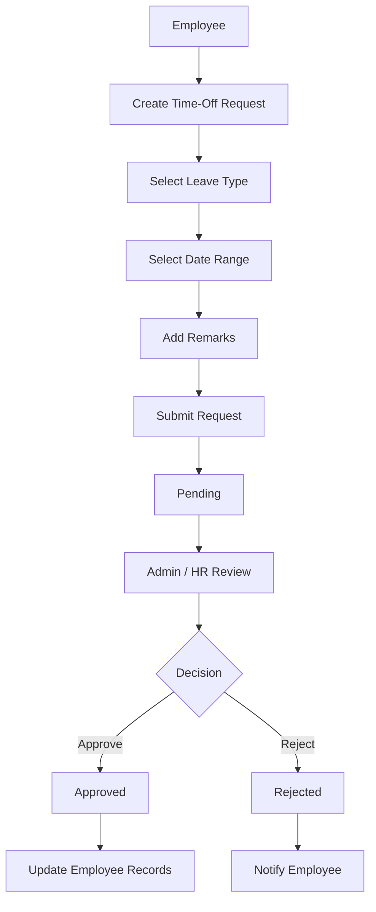
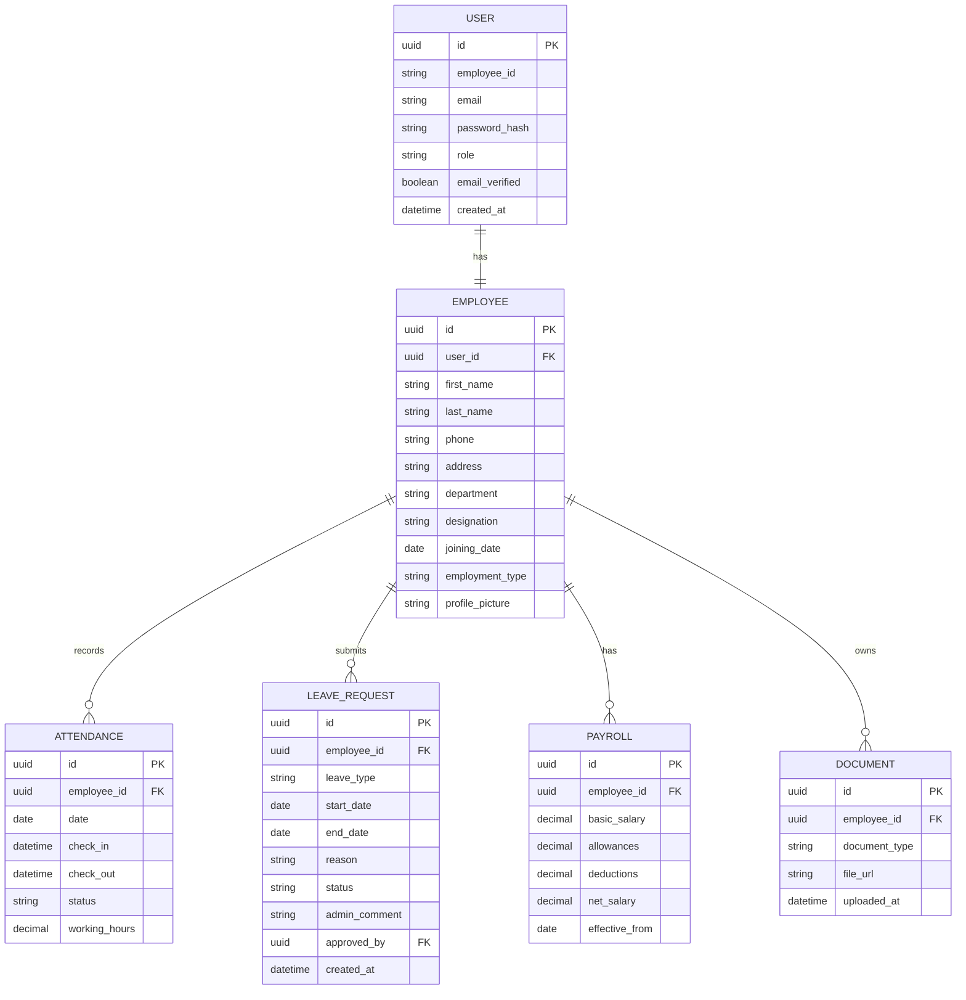
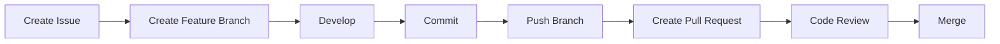

# Dayflow

> **Every workday, perfectly aligned.**

Dayflow is a Human Resource Management System (HRMS) designed to digitize and streamline essential employee-management operations such as employee onboarding, profile management, attendance tracking, time-off management, payroll visibility, and approval workflows.

The platform provides separate experiences for **Administrators / HR Officers** and **Employees**, with role-based access control ensuring that each user can access only the features and information relevant to their role.

---

## ✨ What is Dayflow?

Dayflow is a centralized HR management platform that helps organizations manage their workforce through a single digital system. Instead of handling employee records, attendance, leave requests, and salary information through disconnected spreadsheets or manual processes, Dayflow brings these operations together into one structured workflow.

Employees can securely access their profiles, track attendance, check in and check out, apply for time off, monitor request status, and view their salary information. Administrators and HR Officers can manage employee records, monitor attendance, review time-off requests, approve or reject requests, and manage salary information.

The primary goal of Dayflow is to make everyday HR operations **simpler, more transparent, secure, and less dependent on manual administration**.

---

# 🎯 Problem We Solve

Many organizations still depend on spreadsheets, emails, paper forms, and manual communication for everyday HR operations.

This creates problems such as:

* Scattered employee information
* Manual attendance tracking
* Difficult leave approval processes
* Lack of visibility into request status
* Payroll information being difficult to manage
* Increased possibility of data-entry errors
* No centralized employee-management system
* Limited access control for sensitive HR information

Dayflow addresses these problems by providing a centralized HRMS with structured workflows and role-based permissions.

---

# 🚀 MVP

The Dayflow MVP focuses on the essential HR workflows required for a functional HR management system.

```text
┌────────────┐     ┌────────────┐     ┌────────────┐
│ Employees  │     │ Attendance │     │  Time Off  │
└────────────┘     └────────────┘     └────────────┘
       │                  │                   │
       └──────────────────┼───────────────────┘
                          ↓
                     ┌──────────┐
                     │ Payroll  │
                     └──────────┘
```

### MVP Modules

| Module               |       Employee |    Admin / HR |
| -------------------- | -------------: | ------------: |
| Authentication       |              ✓ |             ✓ |
| Email Verification   |              ✓ |             ✓ |
| Profile Management   |              ✓ |             ✓ |
| Employee Management  |    Own profile | All employees |
| Attendance           | Own attendance | All employees |
| Check-in / Check-out |              ✓ |          View |
| Time-Off Application |              ✓ |             ✓ |
| Time-Off Approval    |              — |             ✓ |
| Payroll View         |     Own salary | All employees |
| Salary Management    |              — |             ✓ |
| Role-Based Access    |              ✓ |             ✓ |

---

# 👥 User Roles

Dayflow has two primary user roles.

## Admin / HR Officer

Administrators and HR Officers have management and approval privileges.

They can:

* View employees
* Manage employee information
* View employee attendance
* Monitor attendance records
* View time-off requests
* Approve or reject time-off requests
* Add approval comments
* View payroll information
* Update salary structures

## Employee

Employees have access to their own HR information and self-service functionality.

They can:

* View their profile
* Update permitted personal information
* Upload a profile picture
* Check in
* Check out
* View their attendance
* Apply for time off
* View time-off request status
* View salary information
* View available documents

---

# 🔄 Core Workflow

The overall Dayflow workflow can be represented as:



---

# 👤 Employee Management

Employee management provides administrators with a centralized view of the organization's workforce.

Administrators can access employee information such as:

* Employee ID
* Name
* Email
* Phone
* Address
* Department
* Designation
* Joining date
* Employment type
* Profile picture
* Salary structure
* Documents

Employees have restricted editing permissions.

### Employee Profile Flow



### Employee Editable Fields

Employees can update:

* Address
* Phone number
* Profile picture

Administrators can update the complete employee profile.

---

# 🕐 Attendance

Dayflow provides digital attendance tracking with daily and weekly views.

Employees can:

* Check in
* Check out
* View today's attendance
* View historical attendance
* View weekly attendance

Administrators can view attendance records across the organization.

### Attendance Status

| Status   | Description                             |
| -------- | --------------------------------------- |
| Present  | Employee completed a normal working day |
| Absent   | Employee did not attend                 |
| Half-day | Employee worked for a partial day       |
| Leave    | Employee was approved for time off      |

### Attendance Flow



### Example

```text
Employee: Janani
Date: 22 August 2026

Check In:   09:05 AM
Check Out:  05:45 PM

Working Duration:
8 hours 40 minutes

Status:
Present
```

---

# 🌴 Time Off

Employees can request time off directly through Dayflow.

Supported leave types include:

* Paid Leave
* Sick Leave
* Unpaid Leave

Employees submit:

* Leave type
* Start date
* End date
* Remarks / reason

### Time-Off Flow



### Request Status

```text
Pending
   │
   ├── Approved
   │
   └── Rejected
```

Administrators can add comments when approving or rejecting a request.

---

# 💰 Salary

Dayflow provides salary visibility to employees while allowing authorized administrators to manage salary structures.

Employees have **read-only access** to their salary information.

Administrators can:

* View employee salary
* Update salary structure
* Manage allowances
* Manage deductions
* Verify payroll information

### Salary Calculation

A simplified salary calculation can be represented as:

```text
Gross Salary
    =
Basic Salary
+ Allowances
```

```text
Net Salary
    =
Gross Salary
- Deductions
```

### Example

```text
Basic Salary       = ₹30,000
Allowances         = ₹5,000
-----------------------------
Gross Salary       = ₹35,000

Deductions         = ₹3,000
-----------------------------
Net Salary         = ₹32,000
```

The actual salary calculation rules can be extended according to the organization's payroll requirements.

---

# 🔐 Security & Permissions

Security is a core part of Dayflow because the system handles sensitive employee and payroll information.

## Authentication

The system supports:

* User registration
* Email verification
* Secure login
* Password hashing
* Authentication sessions
* Logout

## Authorization

Dayflow uses role-based access control.

```text
                    DAYFLOW
                       │
              Authentication
                       │
                Role Detection
                       │
             ┌─────────┴─────────┐
             │                   │
         EMPLOYEE             ADMIN / HR
             │                   │
        Limited Access       Management Access
```

### Role Permission Matrix

| Feature                    | Employee | Admin / HR |
| -------------------------- | -------: | ---------: |
| Login                      |        ✓ |          ✓ |
| View Own Profile           |        ✓ |          ✓ |
| Edit Own Address           |        ✓ |          ✓ |
| Edit Own Phone             |        ✓ |          ✓ |
| Edit Own Profile Picture   |        ✓ |          ✓ |
| Edit Other Employees       |        ✗ |          ✓ |
| View Own Attendance        |        ✓ |          ✓ |
| View All Attendance        |        ✗ |          ✓ |
| Check In / Check Out       |        ✓ |          — |
| Apply Time Off             |        ✓ |          — |
| View Own Time-Off Requests |        ✓ |          ✓ |
| Approve Time Off           |        ✗ |          ✓ |
| Reject Time Off            |        ✗ |          ✓ |
| View Own Salary            |        ✓ |          ✓ |
| View All Salaries          |        ✗ |          ✓ |
| Update Salary              |        ✗ |          ✓ |
| Manage Employees           |        ✗ |          ✓ |

### Important Security Principle

Authorization must be enforced on the **backend**, not only through frontend UI restrictions.

For example, hiding an "Update Salary" button from an employee is not sufficient.

The API must also reject unauthorized requests.

---

# 🗃️ Architecture

Dayflow follows a layered application architecture.

```text
┌───────────────────────────────┐
│          Frontend             │
│                               │
│ React / TypeScript / UI       │
└───────────────┬───────────────┘
                │
                │ HTTP / REST API
                ↓
┌───────────────────────────────┐
│          Backend              │
│                               │
│ Node.js / Express             │
│ Authentication               │
│ Authorization                │
│ Business Logic               │
│ Validation                   │
└───────────────┬───────────────┘
                │
                │ Database Queries
                ↓
┌───────────────────────────────┐
│          Database             │
│                               │
│ Users                         │
│ Employees                     │
│ Attendance                    │
│ Leave Requests                │
│ Payroll                       │
│ Documents                     │
└───────────────────────────────┘
```

### Request Flow

```text
User
 ↓
React Frontend
 ↓
API Request
 ↓
Authentication Middleware
 ↓
Role Authorization
 ↓
Controller
 ↓
Service / Business Logic
 ↓
Database
 ↓
API Response
 ↓
Frontend
```

This separation keeps the application maintainable and scalable.

---

# 🧩 Data Model

The core data relationships can be represented as:



---

# 🛠️ Tech Stack

> Replace the following entries with the exact technologies actually used by the team before merging this README.

### Frontend

* React
* TypeScript
* Tailwind CSS
* React Router

### Backend

* Node.js
* Express.js
* TypeScript

### Database

* PostgreSQL

### Authentication & Security

* JWT / secure session authentication
* Password hashing
* Role-Based Access Control

### Development Tools

* Git
* GitHub
* Postman

### Deployment

* Frontend: To be finalized
* Backend: To be finalized
* Database: To be finalized

---

# ⚙️ Setup

## Prerequisites

Make sure the following are installed:

```text
Node.js
npm
Git
PostgreSQL
```

## Clone the Repository

```bash
git clone <repository-url>
cd dayflow
```

## Frontend Setup

```bash
cd frontend
npm install
npm run dev
```

The frontend will start on the development server.

## Backend Setup

Open another terminal:

```bash
cd backend
npm install
npm run dev
```

## Environment Variables

Create a `.env` file inside the backend directory.

Example:

```env
PORT=5000

DATABASE_URL=your_database_url

JWT_SECRET=your_secure_secret

EMAIL_HOST=your_email_host
EMAIL_PORT=your_email_port
EMAIL_USER=your_email
EMAIL_PASSWORD=your_email_password
```

Do not commit `.env` files or secrets to GitHub.

Use `.env.example` to document the required variables:

```env
PORT=
DATABASE_URL=
JWT_SECRET=
EMAIL_HOST=
EMAIL_PORT=
EMAIL_USER=
EMAIL_PASSWORD=
```

---

# 🌱 Future Enhancements

The MVP can be extended with additional enterprise features.

## Notifications

* Email notifications
* In-app notifications
* Leave approval notifications
* Attendance reminders

## Analytics & Reports

* Attendance analytics
* Leave analytics
* Payroll reports
* Department-level statistics
* Monthly HR reports

## Salary Slips

Employees can download monthly salary slips as PDF documents.

## Advanced Attendance

Potential enhancements include:

* Work-hour analytics
* Late arrival detection
* Overtime tracking
* Attendance regularization

## Advanced HR Features

Future versions could include:

* Employee onboarding workflows
* Performance management
* Department management
* Shift management
* Holiday calendar
* Leave balance management
* Expense management

## Audit Logs

An audit system can track sensitive operations:

```text
Admin changed employee profile
Admin approved leave
Admin rejected leave
Admin updated salary
Employee checked in
Employee checked out
```

This improves accountability and security.

---

# 👨‍💻 Team / Git Workflow

Dayflow follows a feature-branch workflow.

```text
main
 │
 ├── feature/authentication
 ├── feature/employee-management
 ├── feature/attendance
 ├── feature/time-off
 ├── feature/payroll
 └── feature/dashboard
```

## Development Workflow



### Branch Naming

Use descriptive branch names:

```text
feature/authentication
feature/attendance
feature/leave-management
feature/payroll
fix/login-validation
fix/attendance-calculation
```

### Commit Examples

```text
feat: implement employee registration
feat: add role based authorization
feat: implement attendance check in
feat: add leave approval workflow
fix: prevent duplicate check in
fix: validate leave date range
```

### Pull Requests

Every feature should be submitted through a Pull Request.

A Pull Request should contain:

* What was implemented
* Related issue
* Screenshots where applicable
* API changes
* Testing performed
* Known limitations

Avoid directly pushing feature code into `main`.

---

# 📌 Project Status

## Current Development Status

| Module              | Status         |
| ------------------- | -------------- |
| Project Setup       | 🟡 In Progress |
| Authentication      | 🟡 In Progress |
| Role-Based Access   | 🟡 In Progress |
| Employee Management | 🟡 In Progress |
| Attendance          | ⬜ Planned      |
| Time Off            | ⬜ Planned      |
| Payroll             | ⬜ Planned      |
| Admin Dashboard     | ⬜ Planned      |
| Employee Dashboard  | ⬜ Planned      |
| Notifications       | ⬜ Future       |
| Analytics           | ⬜ Future       |
| Salary Slips        | ⬜ Future       |

> **Status should be updated as features are merged into the main branch.**

---

# 📈 Development Roadmap

```text
Phase 1
Project Setup
      ↓
Phase 2
Authentication + RBAC
      ↓
Phase 3
Employee Management
      ↓
Phase 4
Attendance
      ↓
Phase 5
Time-Off Workflow
      ↓
Phase 6
Payroll
      ↓
Phase 7
Dashboards
      ↓
Phase 8
Testing
      ↓
Phase 9
Deployment
      ↓
Phase 10
Analytics + Notifications
```

---

# 🧪 Testing Strategy

Dayflow should be tested at multiple levels.

### Authentication Tests

* Valid registration
* Duplicate email
* Invalid password
* Invalid login
* Unverified email
* Unauthorized access

### Attendance Tests

* Check-in
* Check-out
* Duplicate check-in
* Check-out without check-in
* Multiple attendance records on the same date

### Time-Off Tests

* Valid request
* Invalid date range
* Overlapping request
* Approve request
* Reject request
* Unauthorized approval attempt

### Authorization Tests

Verify that:

```text
Employee → Cannot access Admin APIs
Employee → Cannot modify salary
Employee → Cannot approve leave
Admin → Can manage employees
Admin → Can view organization attendance
```

---

# 🔒 Data Protection

Dayflow handles sensitive employee information and should follow secure development practices.

The application should:

* Hash passwords
* Never expose password hashes through APIs
* Validate API input
* Sanitize user input
* Protect authenticated routes
* Enforce authorization server-side
* Use HTTPS in production
* Store secrets in environment variables
* Restrict access to payroll information
* Avoid committing credentials to Git
* Maintain audit records for sensitive operations

---

# 📊 Project Vision

Dayflow is designed to evolve from a basic HRMS MVP into a complete workforce-management platform.

The long-term architecture can support:

```text
                DAYFLOW
                   │
       ┌───────────┼───────────┐
       │           │           │
   Workforce   Attendance   Payroll
   Management               Management
       │           │           │
       └───────────┼───────────┘
                   │
              HR Analytics
                   │
             Notifications
                   │
             Intelligent HR
```

The MVP focuses on getting the fundamental HR workflows correct before introducing advanced analytics, automation, and intelligence.

---

## 📄 License

Add the project's selected license here, for example:

```text
MIT License
```

Only include a license that the project owners have actually chosen.

---

## ⭐ Dayflow

**Every workday, perfectly aligned.**

Dayflow brings employee management, attendance, time off, and payroll visibility into one centralized HR platform.
